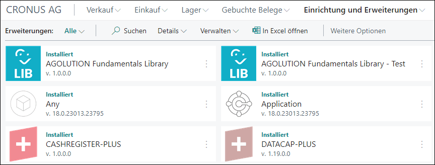

# App-Icons

| Content      | Icon         | SVG                 | PDF                 | PNG 50px              | PNG 216px              | PNG 500px              | PNG 1000px              |
| ------------ | ------------ | ------------------- | ------------------- | --------------------- | ---------------------- | ---------------------- | ----------------------- |
| **PTE-Icon** | ![PTE-PNG50] | [Download][PTE-SVG] | [Download][PTE-PDF] | [Download][PTE-PNG50] | [Download][PTE-PNG216] | [Download][PTE-PNG500] | [Download][PTE-PNG1000] |
| **LIB-Icon** | ![LIB-PNG50] | [Download][LIB-SVG] | [Download][LIB-PDF] | [Download][LIB-PNG50] | [Download][LIB-PNG216] | [Download][LIB-PNG500] | [Download][LIB-PNG1000] |

[PTE-SVG]: app-icon-pte.svg
[PTE-PDF]: app-icon-pte.pdf
[PTE-PNG50]: app-icon-pte-50px.png
[PTE-PNG216]: app-icon-pte-216px.png
[PTE-PNG500]: app-icon-pte-500px.png
[PTE-PNG1000]: app-icon-pte-1000px.png

[LIB-SVG]: app-icon-lib.svg
[LIB-PDF]: app-icon-lib.pdf
[LIB-PNG50]: app-icon-lib-50px.png
[LIB-PNG216]: app-icon-lib-216px.png
[LIB-PNG500]: app-icon-lib-500px.png
[LIB-PNG1000]: app-icon-lib-1000px.png

## Usage

These app icons are used in the development of [Business Central extensions](https://appsource.microsoft.com/de-de/marketplace/apps?search=agolution) and are displayed to the user in the extension management.

