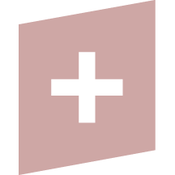
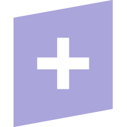
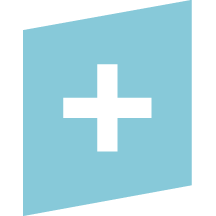
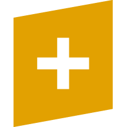
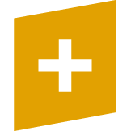
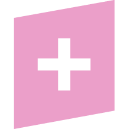

## AGOLUTION GmbH Brands

This repository contains the logos, icons, color palettes and other media of AGOLUTION GmbH and its products.

| Name               | Logo                                                                  | Icons (216x216, 162x162, 48x48 Pixel)                                                                                                                                                                                                                                                                                     | Color     | More                               |
| ------------------ | --------------------------------------------------------------------- | ------------------------------------------------------------------------------------------------------------------------------------------------------------------------------------------------------------------------------------------------------------------------------------------------------------------------- | --------- | ---------------------------------- |
| [DATACAP+][1]      |                                                                       |                               | `#123456` | [datacap-plus](datacap-plus)       |
| [DOCHISTORY+][2]   |                                                                       |    | `#123456` | [dochistory-plus](dochistory-plus) |
| [DOCOUT+][3]       |              |                                        | `#123456` | [docout-plus](docout-plus)         |
| [DOCIN+][4]        |                 |                                                 | `#123456` | [docin-plus](docin-plus)           |
| [BONI+][5]         |                                                                       |                                                          | `#123456` | [boni-plus](boni-plus)             |
| [DATARENAME+][6]   |  |                                                                                                                                                                                                                                                                                                                           | `#123456` | [datarename-plus](datarename-plus) |

[1]: https://datacap.plus
[2]: https://dochistory.plus
[3]: https://docout.plus
[4]: https://docin.plus
[5]: https://boni.plus
[6]: https://datarename.plus